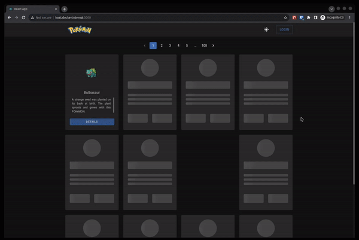

# POKEDEX



## ☢️ NÃO É UMA SIMPLES POKEDEX

Além de ser uma Pokédex completa, este projeto vai além com funcionalidades avançadas. Possui um design moderno desenvolvido em React, com layout responsivo, modo noturno, otimização de desempenho através do React-Query e um sistema seguro e robusto de login para que você possa marcar seus Pokémon prediletos. Adicionalmente, a Pokédex se conecta a um middleware backend feito em NestJS, otimizado para caching e acesso de recursos personalizados.

### 🎨 Características

- **React:** Desenvolvido usando a mais recente versão do React.
- **Material Design com MUI:** Estética e funcionalidade inspiradas no Material Design, com componentes e ícones oriundos de @mui/material e @mui/icons-material.
- **Desenvolvimento em TypeScript:** Código fonte da Pokédex escrito em TypeScript, o que assegura robustez e clareza na lógica do projeto.
- **Dados Otimizados com React-query:** Pokédex utiliza caching com react-query, minimizando a necessidade de requisições repetidas e acelerando o carregamento de dados.
- **Conexão com Backend em NestJS:** A Pokédex se integra a um middleware backend robusto desenvolvido em NestJS, otimizado para caching e eficiência no acesso de recursos.
- **Dark mode:** Uma interface que cuida dos seus olhos! Alterne facilmente entre os modos de acordo com sua preferência.
- **Pokedex Personalizada:** Faça login e salve seus Pokémon favoritos para acessar rapidamente sempre que quiser.
- **Autenticação com Keycloak:** A Pokédex oferece um sistema de login seguro e robusto através da integração do @react-keycloak/web e keycloak-js.
- **Layout Responsivo:** Adapta-se perfeitamente a qualquer tamanho de tela, desde dispositivos móveis a desktops.
- **Carrossel MUI:** Destaques e apresentações interativas na Pokédex são feitos com o componente react-material-ui-carousel.

### 🚀 Começando

**⚠️ Antes de executar esta aplicação, é essencial que todo o [backend](https://github.com/yuripinheirot/pokemon-project-back) seja configurado e instalado corretamente.**

### Pré-requisitos

- Node.js >= 16
- yarn
- git

### Instalação

1. Clone este repositório:
``` shell
git clone https://github.com/yuripinheirot/pokemon-project-front
```

2. Navegue até o diretório do projeto:
``` shell
cd pokemon-project-front
```

3. Instale as dependências:
``` shell
yarn
```

4. Execute o aplicativo localmente:
``` shell
yarn dev
```

O aplicativo agora estará rodando em [http://localhost:3000](http://localhost:3000).

### 🛠️ Construído Com

- [React](https://reactjs.org/)
- [React-Query](https://react-query.tanstack.com/)
- [React Material-UI Carousel](https://github.com/Learus/react-material-ui-carousel): Destaques e apresentações interativas na Pokédex.
- [MUI (Material-UI)](https://mui.com/): Estética e funcionalidade inspiradas no Material Design, com componentes e ícones.
- [Keycloak](https://www.keycloak.org/): Autenticação robusta através da integração do Keycloak.
- [TypeScript](https://www.typescriptlang.org/): Código fonte da Pokédex escrito em TypeScript, assegurando robustez e clareza.

### 📝 Licença

Este projeto está sob a licença MIT. Veja o arquivo [LICENSE](https://chat.openai.com/c/LICENSE) para mais detalhes.

### 💬 Contribuições

Contribuições são sempre bem-vindas! Sinta-se à vontade para abrir uma `issue` ou enviar um `pull request`.
